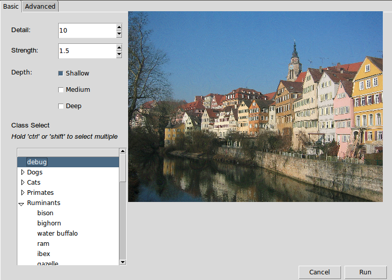
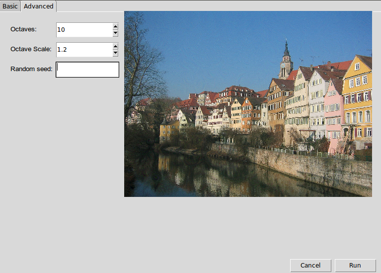
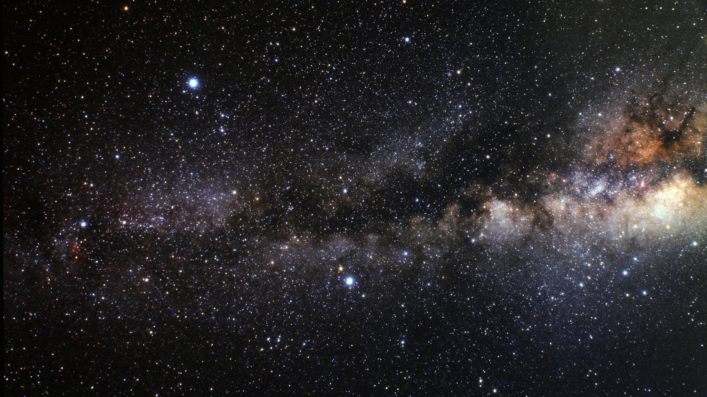
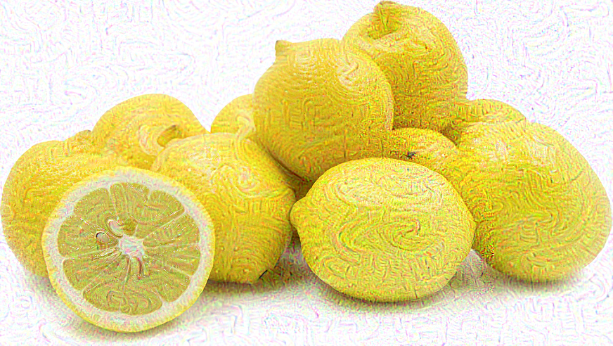

# DeepDream Gimp Plug-in

In recent years there has been a dearth of deep learning algorithms and techniques, including many that can be used for artistic purposes, such as Deepdream, neural style transfer, and more. However, many of these still require a significant amount of technical skill to use, making them inaccessible to the vast majority of artists who would potentially use them

This plug-in for Gimp allows users to filter layers of an image by augmenting them with features learned by deep vision networks. The network currently used by this plug-in is an implementation of Google’s Inception network trained on the ImageNet dataset, labelled by 1001 different objects, animals, or land features. Users can add features from one or many classes, choose the number of iterations over which the features are added and the strength of the change made per iteration. 

The purpose of this project is to provide artists with access to the Google DeepDream engine in an environment that they are already familiar with. DeepDream is a new technology that has mostly stayed within the confines of the machine learning community, but it has great artistic potential. By creating a plug-in for an image-editing program like GIMP, artists are able to use this new technology in a way that’s easily integrable into their existing workflow.

## Software Components

The graphical user interface for the main program is implemented using the library Tkinter, the network operations are implemented using the library Tensorflow, the layers to be processed are queried via the gimp interface, and the functions are called by a registration wrapper which registers the plugin to gimp.

The GUI consists of a window with two numerical parameter boxes, three depth selection checkboxes, and a scroll box with folders for selecting or multiple-selecting the class to perform the effect with. There is another tab for selecting more advanced options and an area for viewing a preview of the effect as it’s being generated.

The pre-trained network is loaded from a file, and the features are generated by calculating the gradients of the image with respect to the selected classes at the selected depths. This means that for each iteration, the network finds those parts of the image that most indicate the presence of the selected class, and changes the image to make it more indicative of that class, scaled by the amount indicated by the strength parameter.

## Installation

### System requirements:

In its current state, this plug-in requires users to be using Ubuntu as their operating system. Users also must be using version 2.8 of GIMP. The plug-in performs faster if the user has a GPU with CUDA, but this is not necessary.

### Install dependencies:

The deepdream plug-in requires:
Gimp
Python 2
Gimpfu
Tensorflow
Numpy
IPython
TKinter
Pillow

Optional dependencies for GPU acceleration:
CUDA
CUDNN
CUDA-compatible GPU

To install, run ‘python deepdream_installer.py’. This script copies the relevant files to the user’s GIMP plug-ins folder. 

The components of the plugin do not need to be compiled, but CUDA and CUDNN can be installed by building it if you choose to install them via that method.

## Usage

Once installed, the plugin will appear in the “filters” menu. There are two versions, “Deepdream,” and “DeepdreamLegacy.” The legacy version uses the built-in plugin GUI, and as such requires fewer dependencies, and can be used if the full version doesn’t work, however it does not support selecting multiple layers or classes and does not have the “Random Seed” option.

The GUI includes the following parameters:

### The “Basic” tab

**Detail:** 
This controls the number of iterations performed per octave, and roughly corresponds to the amount of fine detail the network will be able to produce and also the total strength of the effect. Note that runtime increases as this value is increased.

**Strength:** 
This controls the size of each step. This value does not affect runtime. Increasing strength can result in over-saturated, noisy results.

**Depth:**
This controls where in the network the classes are pulled from. In general, the shallow layer is more abstract, with a vaguer concept of images, but this is not always observed. Choosing deeper layers increases runtime, though for best results, select all three. At least one layer must be selected.

**Class:**
This controls what object or objects will be used for the effect. The triangles on the left side can be used to expand and collapse categories. Multiple classes can be selected by control- or shift-clicking. At least one class must be selected to run the plugin correctly. 

A note on the “Debug” class-- this class emphasizes any and all features observed, but has a very low strength. In order to use this class, you will have to increase the strength and iterations significantly to see results.

### The “Advanced” tab

The parameters in this tab require some understanding of how this version of deepdream is implemented. In order to speed up computation, allow the use of arbitrarily-sized images, and have better robustness to scale, we perform the effect on the image at different scales.

**Octaves**
This represents the number of different sizes the effect is performed at. Increasing this will increase running time, but can give better results if you are using a very large image.

**Octave Scale**
This controls the scaling factor between each different image size (2 is 1/2 the size, 1.5 is 2/3 the size, 1.2 is 5/6 the size, etc.) As we skip scales that are too small for the network to process, this value should be decreased if the number of octaves is increased, and can be increased if you are using a very large image. 

**Random Seed**
As the effect uses some randomized elements, by default it will produce different results each time. If you want to produce more consistent results, you can use this option to fix the seed.

### Controlling running time
While we have optimized the effect to run in a reasonable amount of time, it can sometimes take some time to run, especially through large amounts of experimentation and iteration. Here are some ways to reduce the running time:

**GPU Acceleration**
If you have CUDA, CUDNN, and GPU Tensorflow installed, it should automatically be used to speed up computations. This is the best way to speed up computations on most computers.

**Reduce the Detail and increase the strength.** This will perform fewer iterations at a higher step size, which will result in approximately the same total strength, however because the network will have fewer chances for feedback, it will result in lower-quality output.

**Reduce the number of octaves, increase octave scale.** This will resize the image fewer times at larger scales, reducing the total runtime. This will result in a rougher transition between various scales and fewer chances for feedback, which could also result in lower-quality output.

**Use only the “Shallow” layer.** In general, the “Shallow” layer is faster as fewer computations.

## Examples

Original Image:

Same image with "Radio" dreamed onto it:

Original Image:

Same image with "Monolith" dreamed onto it:

Original Image:

Same image with "Maze" dreamed onto it:

Original Image:

Same image with "eel" dreamed onto it:

Additional examples can be found in the “examples” directory.

## Future Improvements

Right now the plugin only generates features based on the gradients with respect to one network, trained on classification of images based on the objects in the image. However, one big addition we could make to the plug-in would be the ability to choose from other networks, trained on other things, such as the generator or discriminator of a Generative Adversarial Network, or a network trained on segmentation rather than classification.

There is also a minor issue with the saturation in the images. Some “tiles” seem to be more affected by the DeepDream engine than others, causing the color depth to be amplified. We’d like to get this sorted out so as to make the images look more consistent.

Additionally, the plugin does not currently support layers with alpha channels-- this is a planned feature.

Another point of improvement is in regard to the cross-platform status of the project. Right now, it works smoothly on Ubuntu with GIMP 2.8. The installer works on MacOS, but the plug-in doesn’t function properly. There hasn’t been much testing as to its functionality on Windows platforms, or other flavors of Linux. We hope to generalize the installer and the plug-in to a wider variety of operating systems so as to reach a larger group of users. Similarly, the installer relies on the user’s GIMP version being v2.8, as this version number appears in a hard-coded directory name. We aim to make the installer more version-independent.

We also might look into creating a similar plug-in for Photoshop. Photoshop is the industry standard for image editing software, and so more artists would be able to use a plug-in built for that program. However, Photoshop is not open source, which is why we selected GIMP to begin with.
